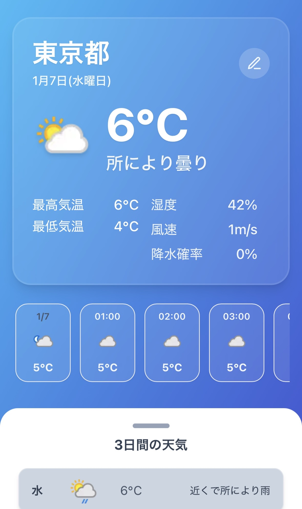
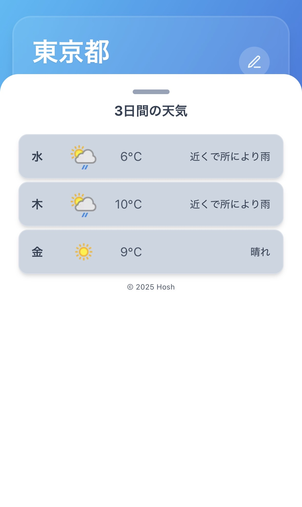
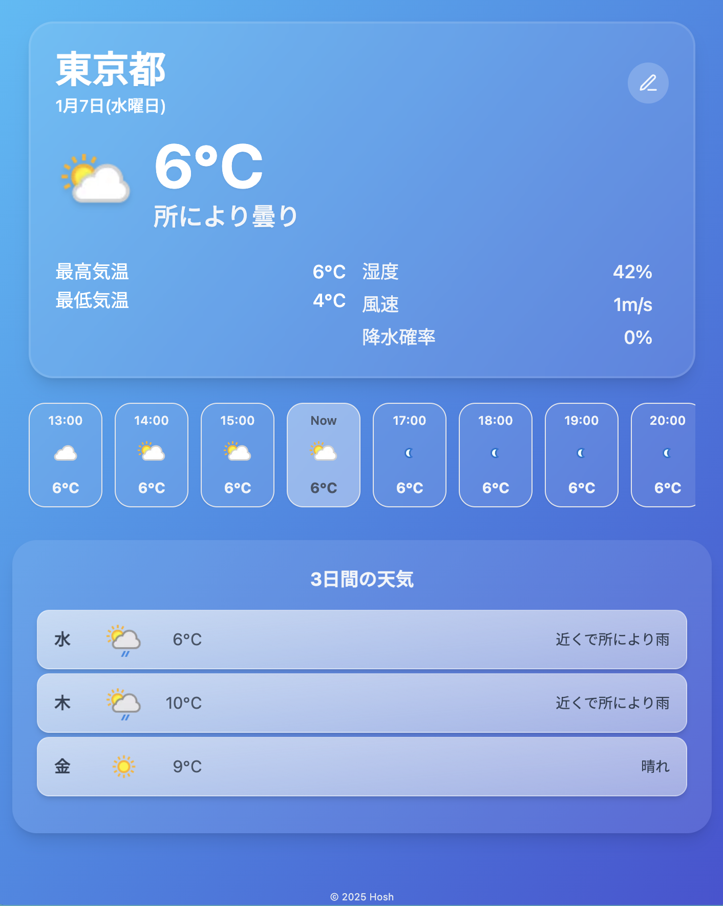
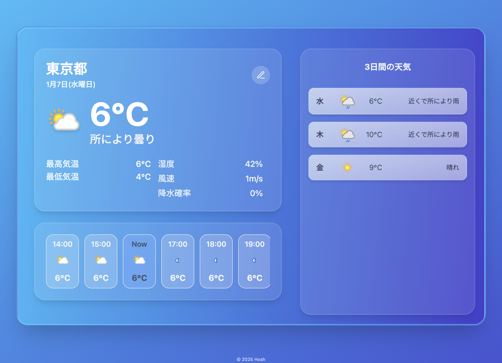

# 天気予報アプリ / Weather App

React・TypeScript・Expressで構築した、WeatherAPI連携の天気予報アプリです。

> NOTE: 予報日数はWeatherAPIのプランに依存します（無料: 3日 / 上位: 最大7日）。

---

## **デモページ**: [https://weather-app-zvhk.onrender.com](https://weather-app-zvhk.onrender.com)

## ページ全体概要 / Screenshots

### モバイル表示（シート： 閉 → 開）

<p>
  
  
</p>

### タブレット表示（sm）



### デスクトップ表示（lg）



---

## 実装機能 / Features

### UI / UX

- WeatherAPIから**現在・時間別・日別**の天気を取得して表示
- **レスポンシブ・グラスモーフィズム**なUI
- 1時間ごとの予報を横スクロールで閲覧し、**Nowカードへ自動センタリング**
- 日次予報はモバイル表示のみ**ボトムシートUI**（スワイプ操作）に対応
  - スワイプ後のタッチイベント誤作動（連続トグル）防止

### 検索とエラーハンドリング

- 都市検索に対応（失敗時の詳細なエラーメッセージ表示）
- エラー発生時の**入力値・UI状態の保持**
- 検索ボタン連打などによる二重送信防止

### データ取得

- APIレスポンスを**Zodでバリデーション**
- Expressサーバー経由でAPIリクエストし、**APIキーをクライアントから隠蔽**
- TanStack Queryで都市別にキャッシュし、切替時に**先読み（事前取得）**

---

## 使用技術 / Tech Stack

- Vite + React + TypeScript
- TanStack Query（キャッシュ付きデータ取得）
- Zod（レスポンス検証）
- Tailwind CSS
- Express（/api/weatherでWeatherAPIを中継）

---

## 使い方 / Usage

### 1) クローン

```bash
git clone https://github.com/fried-hosh/weather-app.git
cd weather-app
npm i
```

### 2) 環境変数

`.env.example`をコピーして`.env`を作成し、`WEATHER_API_KEY`を設定してください。

```env
WEATHER_API_KEY=xxxxxxxxxxxxxxxx
```

### 3) 開発サーバー起動

```bash
# フロント + サーバー同時起動
npm run dev:full
```

---

## npm scripts

- `npm run dev`：フロントのみ（Vite）
- `npm run dev:server`：サーバーのみ
- `npm run dev:full`：フロント + サーバー同時起動
- `npm run build`：本番ビルド
